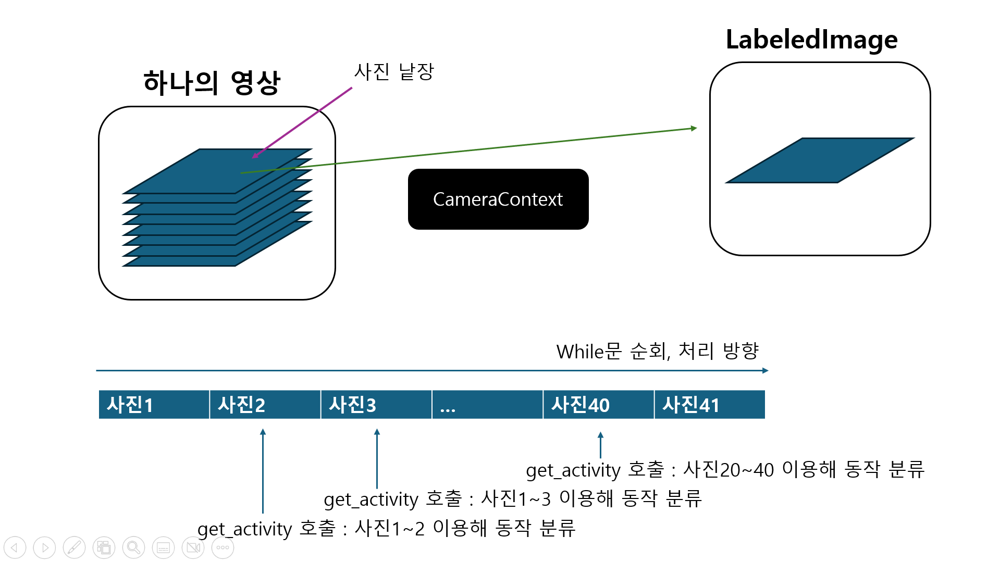

# Docs Intro

본격적으로 소스코드를 해설하기 앞서, 본 소프트웨어의 목적과 기능에 대해서 소개를 하겠습니다.

## 소프트웨어의 목적

**Actlbl**은 `Action Labeler`의 약자로, 촬영 대상의 동작을 분류해주는 기능을 갖고 있습니다. 예를 들어 식사를 하고 있는 사용자에게 '식사중' 태그를, 양치를 하는 사용자에게 '양치중' 태그를 붙여줍니다. **Actlbl**은 사용자의 동작을 분류할 뿐만 아니라 확장가능한 API를 제공하여, IPFS를 활용한 노인 요양 연구 밖에도 다양한 작업을 수행할 수 있게끔 도와줍니다.

## 소프트웨어의 기능

**Actlbl**은 `OpenCV` 라이브러리를 이용하여 영상을 처리합니다. 아래는 `OpenCV`를 이용하여 영상을 처리하는 코드의 일부입니다. 영상의 한 프레임, 즉 사진을 `while`문을 통하여 받아옵니다. 이렇게 하나의 영상을 읽어 연속된 사진의 형태로 받아올 수 있는 것이 `OpenCV`의 기능 중 하나입니다. 여기에서 프레임은 2차원 배열로 구성되어 있습니다. 각 픽셀의 R, G, B 값을 담은 행렬을 이용하여 프레임을 표현합니다. 

```python
while video_source.isOpened():
  ret, frame = video_source.read()          
  
  # 중략
```

하지만 `while`문의 특성상 모든 프레임들이 하나의 순환에서 독립적으로 처리됩니다. 즉, 같은 영상에서도 상대적으로 전에 처리한 프레임은 나중에 처리한 프레임과 어떠한 상호작용도 할 수 없습니다. 이를 극복하기 위해서 **Actlbl**에서는 `CameraContext`라는 클래스를 이용하여 영상에서 프레임을 순회하는 과정에서 서로 공유할 수 있는 인스턴스를 제공합니다. 즉, 일종의 기억 저장소와 같은 역할을 수행합니다.

또한, **Actlbl**은 이 픽셀 행렬을 그대로 다른 곳으로 넘기지 않고 더 고차원의 클래스인 `LabeledImage` 클래스에 담아 사용합니다. 이 클래스에서는 `CameraContext`에서 제공된 이전 사진 데이터들을 이용하여 동작 분류를 수행할 수 있게끔 `get_activity`, `get_subactivity` 메소드를 바로 제공합니다.

이중 `get_activity` 함수에서는 레이블링을 다양한 방식으로 진행합니다. 머신러닝, 규칙기반, 확률기반의 레이블 추정 모델을 포함하고 있습니다. 그리고 그렇게 얻은 3가지 정보를 합산하여 최종 평가에 반영합니다.

그리고 `get_subacitvity` 메소드는 여기에다가 `YOLO`에서 얻은, 촬영 대상과 상호작용하고 있는 사물들을 참고하여 세부적인 레이블을 붙여줍니다.

최종적으로 이 모든 과정을 하나의 그림으로 정리하면 아래와 같습니다.



## 기타 참고사항

**Actlbl**은 데이터 수집을 위한 코드와, 데이터 해석을 하는 코드가 함께 존재합니다. 즉, 모델을 제작하기 위한 코드와 그 모델을 사용하여 실제 사람의 동작을 분류하는 코드가 함께 존재합니다. 따라서 현재 코드 해석을 할 때 헷갈리실 수 있으나, 이는 추후에 해결할 예정이고, 문서에서는 데이터 수집을 위한 코드인지 해석을 위한 코드인지 명시하겠습니다.